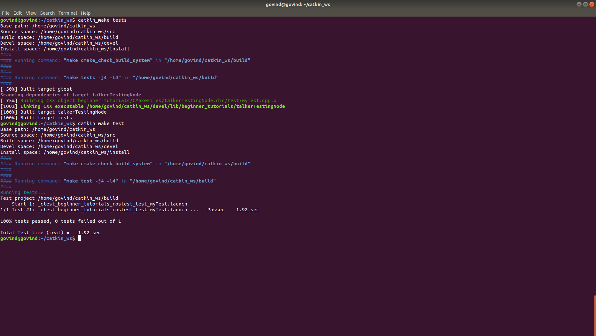

# ROS Publisher/Subscriber

 - Be sure to make changes to CMakeLists.txt and package.xml as needed.

## Author

Govind Ajith Kumar

## Overview

This code is a demo of ROS Bags and tf.

A few of the major files in this package is :

talker.cpp (Publisher)  
listener.cpp (Subscriber)  
nodes_launch.launch (Launch file)  
changeStringService.srv (Service File)  
 
## Assumptions
		ROS Melodic
		Ubuntu 18.04
## General structure of a catkin workspace

		workspace_folder/        -- WORKSPACE
		  src/                   -- SOURCE SPACE
		    CMakeLists.txt       -- 'Toplevel' CMake file, provided by catkin
		    package_1/
		      CMakeLists.txt     -- CMakeLists.txt file for package_1
		      package.xml        -- Package manifest for package_1
		    ...
		    package_n/
		      CMakeLists.txt     -- CMakeLists.txt file for package_n
		      package.xml        -- Package manifest for package_n

## Directory structure of this catkin_ws

		catkin_ws/
			build
			devel
			src
				beginner_tutorials
					CMakeLists.txt
					package.xml
				CMakeLists.txt

## To create the catkin package, building and sourcing it

		$ cd ~/catkin_ws/src
		$ catkin_create_pkg beginner_tutorials std_msgs rospy roscpp
		$ cd ..
		$ catkin_make
		$ . ~/catkin_ws/devel/setup.bash

## Creating the publisher and subscribers

		$ roscd beginner_tutorials
		$ mkdir -p src

## Running catkin_make

		$ cd ~/catkin_ws
		$ catkin_make  

## Before running the talker

		$ roscore

## Running the publisher in a new terminal 

		$ cd ~/catkin_ws
		$ source ./devel/setup.bash
		$ rosrun beginner_tutorials talker      (C++)

## Running the subscriber in a new terminal 

		$ cd ~/catkin_ws
		$ source ./devel/setup.bash
		$ rosrun beginner_tutorials listener     (C++)

## To launch the launch file (add the custom frequency at the end) 

		$ roslaunch beginner_tutorials nodes_launch.launch freq:=5

## To call the ROS Service
		$ rosservice call /changeStringService "String to change the ROS SERVICE"

## Logging using the rqt_console
		$ rqt_console	

## To display and save the rqt_tf_tree as a pdf
		$ rosrun tf view_frames

## TO view the tf frames and check the tf tree
		$ rosrun tf tf_echo /world /talk
		$ rosrun rqt_tf_tree rqt_tf_tree

## Recoridng a rosbag
		$ rosbag record -a

## Playing back the rosbag
		$ rosbag play <your bag file>

## Verifying if rosbag is working correctly

Open a terminal and run the listener node

		$ rosrun <package_name> listener 

Go to the results folder and run the rosbag

		$ rosbag play <your bag file>

Ensure the changes are happening in the terminal where the listener runs

## To verify the test

		$ catkin_make tests
		$ catkin_make test

 - The result will look as follows

  

## To terminate

		press Ctrl-C to terminate both the listener and the talker

## Running cpp-check

		$ cppcheck --enable=all --std=c++11 -I include/ test/ src/ --suppress=missingIncludeSystem $( find . -name *.cpp | grep -vE -e "^./build/" -e "^./vendor/" -e "^./src/")

## Running cpp-lint

		$ cpplint $( find . -name \*.hpp -or -name \*.cpp | grep -vE -e "^./build/" -e "^./vendor/" -e "^./docs/" -e "^./results" )

## Creating tags from the command line

Do the following steps to create a tag for your release

		$ git tag <tagname>
		$ git git push origin --tags
	

